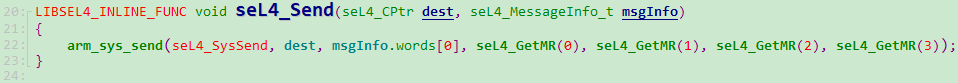
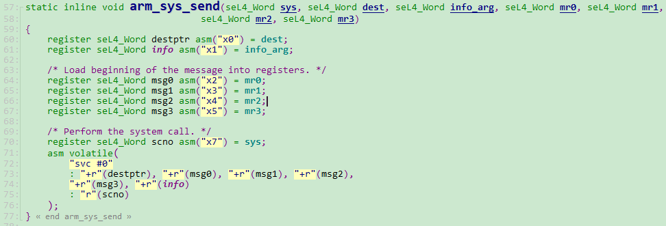
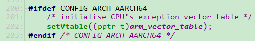
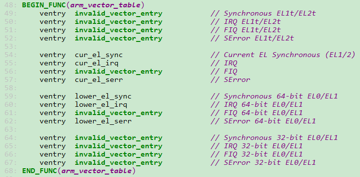
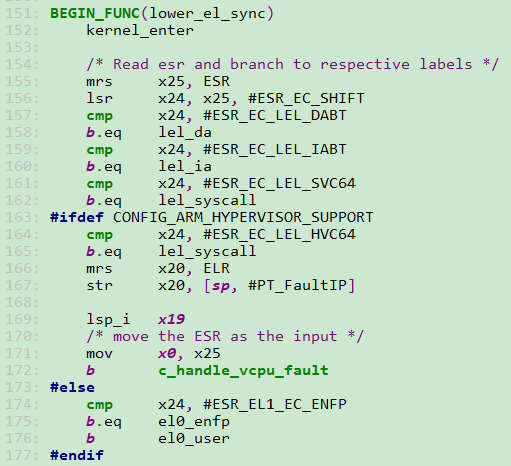
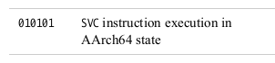
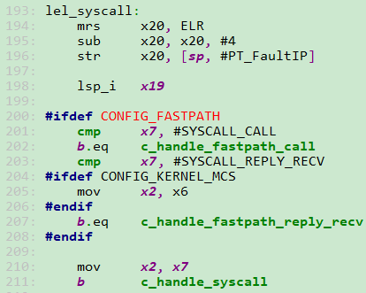
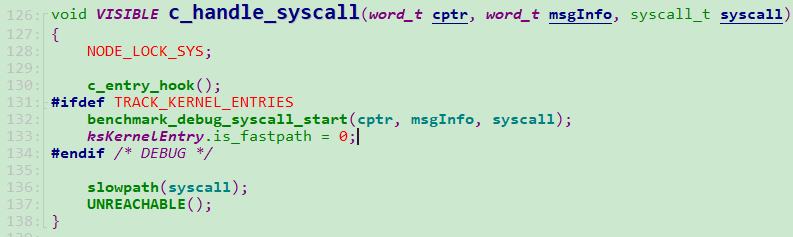
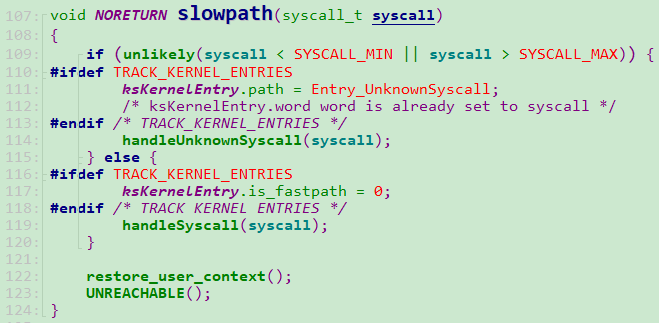

# `seL4_Send`系统调用的过程

### 前提

`ARM64`

不支持虚拟化

不支持`MCS`


以**`seL4_Send`**为例：



第一个参数是系统调用号，后面的是系统调用的参数。

`seL4_Send`->`arm_sys_send`:



这里需要注意的是，系统调用号`seL4_SysSend(-3)`存放在x7寄存器中。

执行第72行的`svc`后，会从当前`EL0`异常等级切到`EL1`异常等级。


### 设置异常向量表

在`seL4`内核启动会设置异常向量表：

相关文件：

`src\arch\arm\64\head.S`

`src/arch/arm/kernel/boot.c`

`src/arch/arm/64/traps.S`


设置异常向量表的调用过程如下：

`_start->init_kernel->try_init_kernel->init_cpu`：



第202行，设置异常向量表基地址，将`vbar_el1`设置为`arm_vector_table`。



如果`EL0`运行在64位模式，那么发生`svc`异常后，PC指针会跳转到上面第59行`lower_el_sync`，同时设置异常返回地址`ELR_EL1`以及`SPSP_EL1`.



第152行，执行kernel_enter，这个函数会把通用寄存器的内容存放到`SP_EL1`指向的内存空间，这里`SP_EL1`指向的是当前`thread`的`NODE_STATE(ksCurThread)->tcbArch.tcbContext.registers`。


当异常发生后，在`ESR_EL1`中存放的是异常发生的原因，对于`SVC`异常，在`ARMv8`的手册中规定如下：



所以最终会执行到第162行，跳转到`lel_syscall`处。




在`arm_sys_send`中将系统调用号-3存放在`x7`寄存器中，所以会执行到第210和211行，将系统调用号存放到`x2`寄存器中，然后跳转到`c_handle_syscall`。

`c_handle_syscall`定义在`src/arch/arm/c_traps.c`中：



这个函数有三个参数，其中`cptr`和`msgInfo`就是传给`seL4_Send`的两个参数，最后一个是系统调用号-3.

暂时忽略第130~133行，最后执行的是第136行`slowpath(syscall)`：



第109~114，检查系统调用号是否合法

第119行，执行系统调用`handleSyscall(syscall)`

第122行，从`EL1`返回到`EL0`，即从内核态返回到用户态，在restore_user_context中比较重要的是会将SP_EL1的内容设置为`NODE_STATE(ksCurThread)->tcbArch.tcbContext.registers`


`handleSyscall(syscall)`定义在`src/api/syscall.c`中(简化后的代码如下)：

```c
exception_t handleSyscall(syscall_t syscall)
{
    exception_t ret;
    irq_t irq;
    MCS_DO_IF_BUDGET({
        switch (syscall)
        {
        // 这里SysSend的值是-3
        case SysSend:
            ret = handleInvocation(false, true, false, false, getRegister(NODE_STATE(ksCurThread), capRegister));
            break;
...
        }
    
    })
    
    schedule();
    activateThread();
    
    return EXCEPTION_NONE;

}
```


上面调用了`handleInvocation`来做进一步处理，如果没有支持`MCS`的话，`handleInvocation`的实现如下:

```c
#define handleInvocation(isCall, isBlocking, canDonate, firstPhase, cptr) handleInvocation(isCall, isBlocking)
```

下面是简化后的代码：

```C
static exception_t handleInvocation(bool_t isCall, bool_t isBlocking)
{
    seL4_MessageInfo_t info;
    lookupCapAndSlot_ret_t lu_ret;
    word_t *buffer;
    exception_t status;
    word_t length;
    tcb_t *thread;

    thread = NODE_STATE(ksCurThread);
    
    /*
    
    */
    info = messageInfoFromWord(getRegister(thread, msgInfoRegister));
    
    cptr_t cptr = getRegister(thread, capRegister);

    /* faulting section */
    lu_ret = lookupCapAndSlot(thread, cptr);
     
    buffer = lookupIPCBuffer(false, thread);
    
    status = lookupExtraCaps(thread, buffer, info);
    
    /* Syscall error/Preemptible section */
    length = seL4_MessageInfo_get_length(info);

    status = decodeInvocation(seL4_MessageInfo_get_label(info), length,
                              cptr, lu_ret.slot, lu_ret.cap,
                              isBlocking, isCall, buffer);
   
    return EXCEPTION_NONE;

}
```

